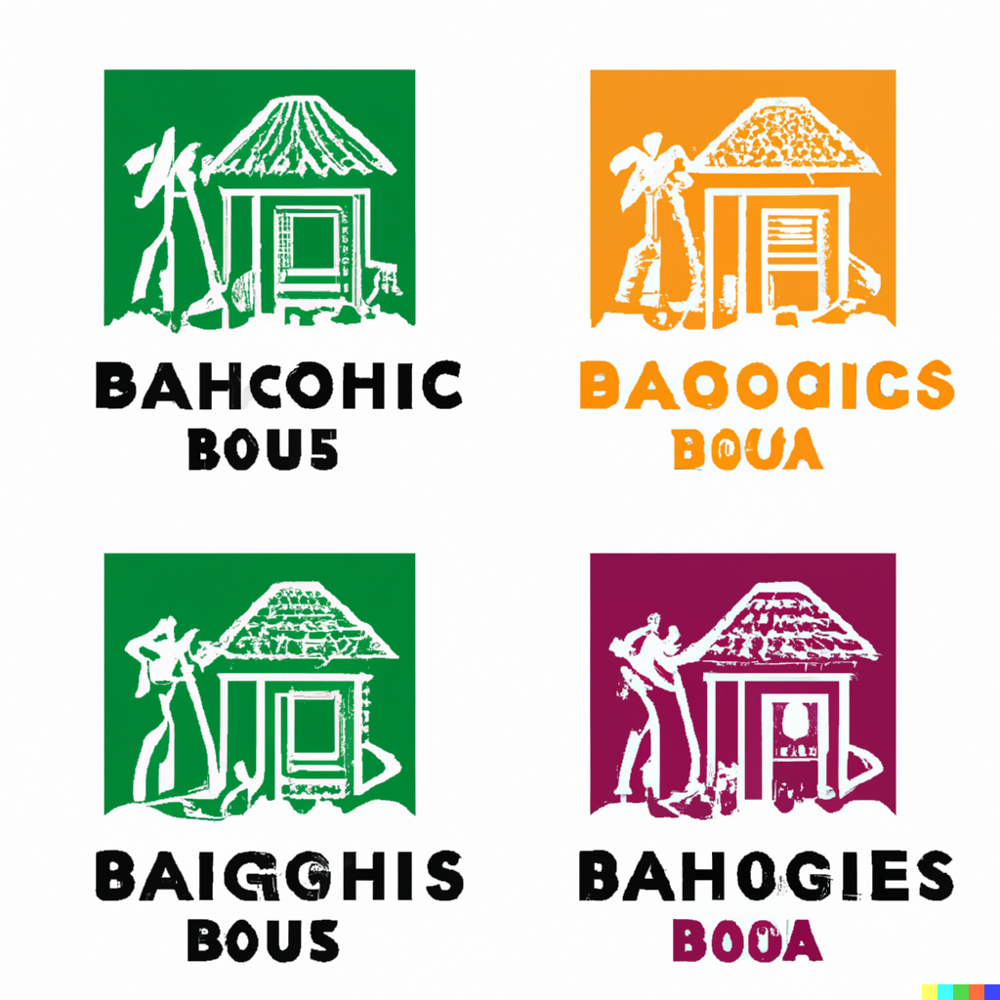

# gsbb-1.github.io

This site is created and host with Github Pages. See https://docs.github.com/en/pages/getting-started-with-github-pages/creating-a-github-pages-site


Mies Van der Rohe cottage with fountain courtyard in style of Van Goh. Use water color. Backdrop is an ocean with island in the background.

Beach bangalows near tropical seaside that is a digital nomad hub. Make this a logo using just 4 colors. Use crisp line.




Everything under *docs/* will be published to https://gsbb-1.github.io/


Run locally

```
py -m http.server -d docs/ 8080
```

Push to master

```
git checkout master
git add ..
git commit -m "..."
git push
```

Merge to **gh-pages** branch to publish to https://gsbb-1.github.io/

```
git checkout gh-pages
git merge master
```


More starter templates using W3CSS

https://www.w3schools.com/howto/default.asp

1. five images
https://www.w3schools.com/w3css/tryw3css_templates_travel.htm

2. hotel main
https://www.w3schools.com/w3css/tryw3css_templates_hotel.htm
- choose three room type


3. social profile
https://www.w3schools.com/w3css/tryw3css_templates_social.htm
